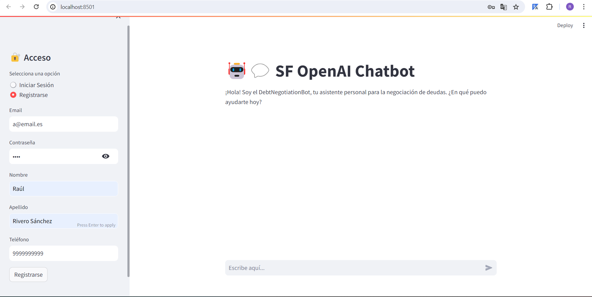
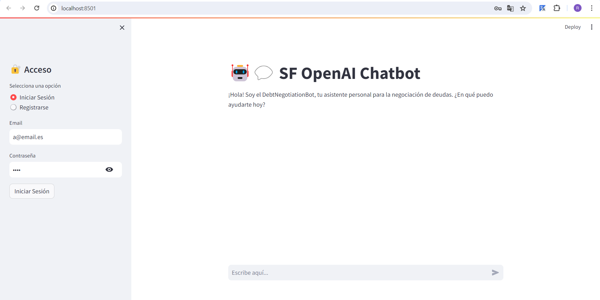
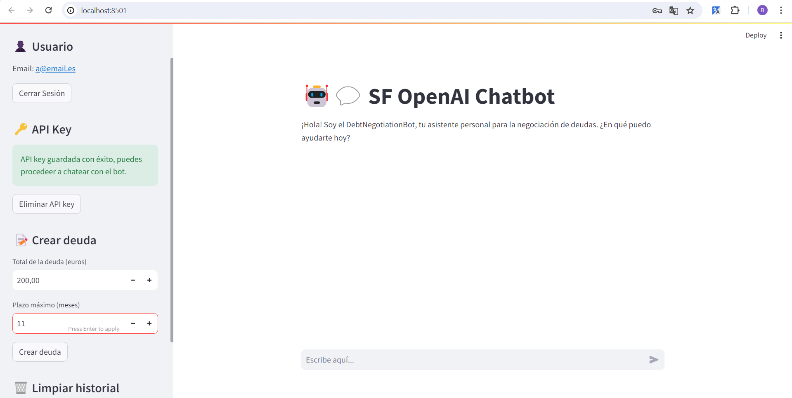
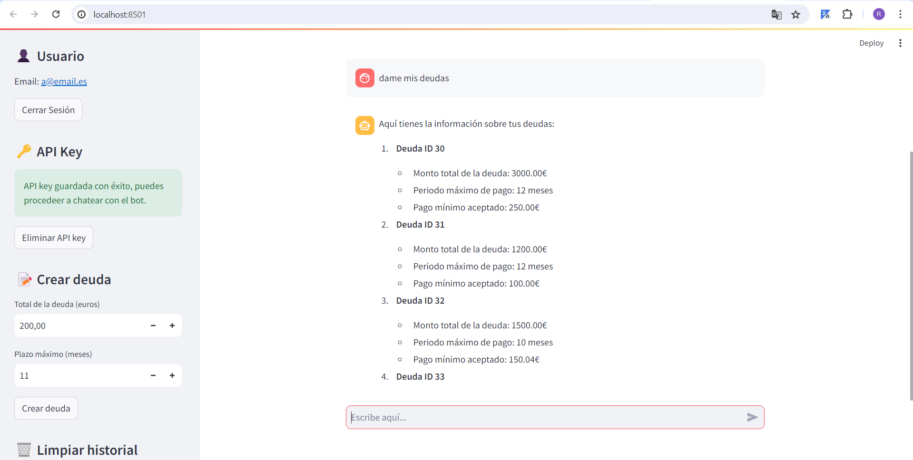
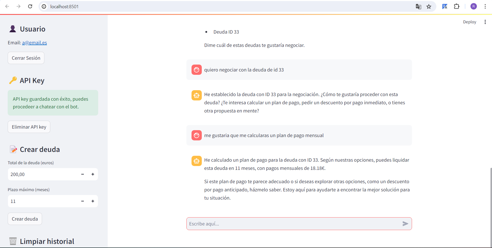
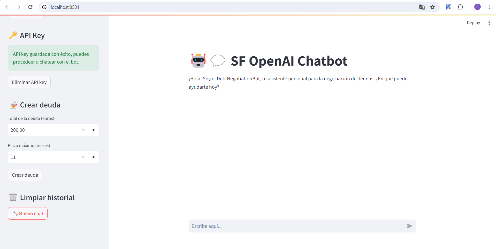

# Chatbot Asistente Financiero

Este proyecto implementa un sofisticado chatbot diseñado para ofrecer asistencia personalizada en la gestión de deudas y la recuperación de documentos, utilizando la API de Assistant de OpenAI. A través de una combinación eficaz entre tecnologías de punta y una interfaz de usuario intuitiva, el chatbot busca transformar la manera en que los usuarios manejan sus compromisos financieros y acceden a información clave almacenada.

## Tecnología y Estructura
El backend del sistema se desarrolla en Flask, un framework de Python altamente flexible y eficiente para aplicaciones web, apoyado por una base de datos SQLAlchemy. Esta estructura asegura un manejo robusto y seguro de la información de los usuarios.

En el frontend, se utiliza Streamlit para crear una aplicación interactiva que comunica directamente con el backend a través de rutas Flask. Este enfoque permite una experiencia de usuario fluida y enfocada en la facilidad de uso y accesibilidad.

## Instalación

Para ejecutar este proyecto, debes tener instalado Python 3.6 o superior en tu máquina. Asegúrate de tener también pip para la gestión de las librerías. Sigue los pasos a continuación para configurar el ambiente y comenzar a utilizar el chatbot.

### Pre-requisitos

Antes de instalar las librerías necesarias, verifica que tengas una versión compatible de Python ejecutando:

```bash
python --version
```

O si tienes instalaciones concurrentes de Python 2 y Python 3, es posible que necesites usar:

```bash
python3 --version
```

## Instalación de librerías
Una vez confirmado el entorno de Python, instala las siguientes librerías requeridas para el funcionamiento del proyecto:

```bash
pip install Flask Flask-SQLAlchemy openai streamlit requests SQLAlchemy python-dotenv
```

Nota: Si estás usando un ambiente virtual (lo cual es recomendado), asegúrate de activarlo antes de ejecutar el comando anterior.

## Configuración de variables de entorno
Este proyecto utiliza variables de entorno para manejar configuraciones sensibles. Crea un archivo .env en la raíz del proyecto y añade las siguientes variables:

OPENAI_API_KEY=tu_llave_de_api_aquí
SQLALCHEMY_DATABASE_URI=la_uri_de_tu_sql_alchemy_aquí
FLASK_ENV=development # o production o test

Reemplaza tu_llave_de_api_aquí con tu verdadera API key de OpenAI.

## Ejecución

Una vez instaladas las dependencias y configuradas las variables de entorno, puedes iniciar el backend y el frontend en dos terminales por separado:

Para el backend con Flask:

python backend/app.py 

Para el frontend con Streamlit:

streamlit run frontend/streamlit_app.py

Ahora, la aplicación debería estar corriendo en tu máquina local, y puedes interactuar con el chatbot asistente financiero desde la interfaz de usuario de Streamlit.

Este apartado proporciona a los usuarios instrucciones claras sobre cómo preparar su entorno para ejecutar tu proyecto, desde la instalación de librerías necesarias hasta la configuración de variables de entorno y la ejecución de la aplicación. Asegúrate de personalizar nombres de archivos y rutas según corresponda a tu estructura de proyecto específica.

## Uso

1. **Regístrate:** Comienza registrándote en la plataforma para acceder a todas sus funcionalidades. Ingresa tus datos personales y crea una cuenta para comenzar.

<div style="text-align:center;">
    
</div>

2. **Inicia Sesión:** Una vez registrado, inicia sesión con tu correo electrónico y contraseña para acceder a tu cuenta personalizada.

<div style="text-align:center;">
    
</div>

3. **Establece tu API Key:** Para utilizar las capacidades de OpenAI en el chatbot, establece tu API Key de OpenAI. Esto te permitirá obtener respuestas inteligentes y útiles a tus consultas.

<div style="text-align:center;">
    
</div>

4. **Consulta tus deudas:** Utiliza el chatbot para solicitar información sobre tus deudas. Ingresa tus consultas y el chatbot te proporcionará detalles sobre tus deudas pendientes.

<div style="text-align:center;">
    
</div>

5. **Calcula un plan de pago o negocia con tus deudas:** Una vez que tengas información sobre tus deudas, el sistema te permitirá calcular un plan de pago personalizado. Ingresa los detalles relevantes y obtén un plan de pago adecuado para tus necesidades financieras.

<div style="text-align:center;">
    
</div>

6. **Limpia el historial de mensajes:** Para mantener tu conversación organizada, puedes limpiar el historial de mensajes en cualquier momento y comenzar una nueva conversación.

<div style="text-align:center;">
    
</div>


## Características Principales

- **Gestión Personalizada de Deudas:** El chatbot ofrece soluciones a medida para gestionar y negociar deudas, adaptando los planes de pago a la situación financiera individual de cada usuario.

- **Recuperación Rápida de Documentos:** Acceso instantáneo a documentos relevantes, directamente a través de la conversación con el chatbot.

- **Interfaz Intuitiva y Fácil de Usar:** Con una interfaz simplificada y accesible, el chatbot guía a los usuarios a través de los procesos de consulta y negociación de deudas de manera amigable y eficiente.


## Explicación del Código
Este apartado proporciona una visión general de la arquitectura del código y los componentes principales del proyecto. Nuestra aplicación se divide en dos segmentos principales: el backend, desarrollado en Flask, y el frontend, creado con Streamlit. Aquí se describen los componentes clave y cómo interactúan entre sí.

### **Backend (Flask)**

El backend descrito se compone fundamentalmente de una aplicación Flask que integra SQLAlchemy para la gestión de una base de datos, y se estructura en varios componentes clave que permiten crear una API robusta para gestionar usuarios, deudas y sesiones de usuario.

#### - Configuración de la Aplicación (Flask)
El principio de tu aplicación en Flask se establece con un archivo de configuración que diferencia entre entornos de desarrollo, producción y pruebas. Esta distinción es crucial para asegurar que la aplicación se ejecute con las configuraciones adecuadas dependiendo del entorno en el que se encuentre. La instancia de la aplicación se crea mediante la función create_app, la cual configura la aplicación con las opciones apropiadas según el entorno.

```python
def create_app(config_class=Config):
    app = Flask(__name__)
    ...
    Database(app) # Se inicia la base de datos con la configuración aplicada
    return app
```

#### - Gestión de la Base de Datos (SQLAlchemy)
- Database.py: Este archivo se encarga de inicializar la conexión con la base de datos utilizando SQLAlchemy, una ORM que facilita la interacción con la base de datos mediante clases y objetos en vez de SQL puro.
- models.py: Define los modelos User y Debt, que mapean las tablas en la base de datos. Cada modelo corresponde a una tabla, y los atributos del modelo a las columnas de dicha tabla.
CRUD y Lógica de Negocios (CRUDService)
- El archivo CrudPsgService.py contiene la clase CRUDService, que implementa la lógica de negocios para interactuar con los modelos User y Debt, permitiendo crear usuarios, verificar si un usuario existe, crear deudas, entre otras funcionalidades. Esto convierte a CRUDService en el corazón de la interacción con la base de datos.

#### - Autenticación de Usuarios (auth.py)
En auth.py, se maneja la autenticación de los usuarios. Aquí, defines cómo almacenar y gestionar la sesión del usuario autenticado. La clase Authentication permite establecer un usuario, obtener el email de un usuario, y manejar el inicio y cierre de sesión.

#### - Rutas y Endpoints (routes.py)
Finalmente, en routes.py, se exponen varios endpoints de la API para permitir operaciones como la creación de usuarios, eliminación de usuarios, autenticación, gestión de deudas, entre otros. Cada ruta define una función que se ejecuta al realizar una petición HTTP específica. Estas funciones utilizan los servicios definidos en CRUDService para interactuar con la base de datos y devolver una respuesta adecuada al cliente.

Por ejemplo, el endpoint /create_user espera datos JSON con información del usuario, verifica la completitud de estos datos y, utilizando CRUDService, intenta crear un nuevo usuario en la base de datos. Si el usuario ya existe o falta información, se devuelve un error; de lo contrario, el usuario se crea satisfactoriamente.

#### - Integración de Operaciones complejas y Recuperación de Documentos con Chatbot (chatbot.py)
El fichero chatbot.py representa una ampliación significativa de la funcionalidad de tu chatbot al integrar operaciones complejas y recuperación de documentos utilizando la API de OpenAI. La clase Chatbot se encarga de orquestar estas funcionalidades, permitiendo al asistente acceder a documentos y ejecutar funciones específicas basadas en las interacciones del usuario. Veamos los componentes clave:

1. **Inicialización y Creación de Asistentes:** En el método \__init__, se inicializa el chatbot con una serie de herramientas y mensajes del sistema predefinidos, además de establecer la conexión con OpenAI. Si el asistente no está creado, se invoca el método _create_assistant para configurarlo con documentos relevantes y herramientas funcionales.

2. **Gestión de Documentos:** Al crear el asistente, se cargan documentos PDF (como horarios de guaguas y festivos en centros comerciales) en la plataforma de OpenAI. Estos documentos son utilizados para responder preguntas específicas de los usuarios, mejorando la utilidad y precisión del asistente en temas especializados.

3. **Ejecución y Manejo de Peticiones:** El método ask_assistant maneja las solicitudes de los usuarios, enviando sus mensajes al asistente y procesando las respuestas. Este método es capaz de ejecutar acciones automáticas basadas en la interacción, como llamar a funciones predefinidas y manejar solicitudes de información de los documentos asociados.

4. **Operaciones Asíncronas y Llamadas a Funciones:** El chatbot puede requerir acciones específicas del usuario o ejecutar llamadas a funciones internas del sistema. Esto permite una interacción dinámica donde, basado en el contexto o la necesidad de información adicional, se pueden invocar funciones personalizadas para responder eficazmente a las solicitudes del usuario.

5. **Ajustes y Personalización del Asistente:** La clase Chatbot proporciona métodos para configurar la API key de OpenAI, manejar hilos de conversación, y adaptar las herramientas y mensajes de sistema disponibles, ofreciendo un nivel alto de personalización del comportamiento del asistente.


#### - Core de la Personalización del Chatbot (NegotiatorChatbot.py)
El archivo NegotiatorChatbot.py incluye la clase Negotiator, responsable de definir y orquestar el comportamiento avanzado del chatbot:
 
1. **Integrar Herramientas Personalizadas:** La clase Negotiator recupera de negotiator_tools.json un conjunto de herramientas y funciones definidas que el chatbot puede invocar. Este archivo JSON funciona como un inventario de capacidades que se pueden asignar dinámicamente al chatbot, permitiéndole responder a solicitudes específicas con acciones predefinidas o generar respuestas basadas en operaciones complejas. Esto dota al chatbot de una flexibilidad sin precedentes para adaptarse a diversos escenarios de interacción.

2. **Establecer el Contexto de Interacción:** Negotiator configura un mensaje inicial de sistema que actúa como parámetro de entrada al modelo de OpenAI, instruyendo al chatbot no solo en cómo entender las solicitudes de los usuarios, sino cómo contextualizar sus respuestas para ser no solo relevantes, sino también útiles y en consonancia con los objetivos del servicio. Este mensaje guía al modelo de OpenAI para mejorar el rendimiento del chatbot al establecer expectativas claras sobre su funcionalidad y alcance.

3. **Facilitar Operaciones Especializadas:** Además de manejar las herramientas de interacción, Negotiator detalla las funciones específicas que el chatbot puede ejecutar en respuesta a comandos o preguntas del usuario. Estas funciones están meticulosamente definidas para cubrir un amplio rango de operaciones, desde gestionar deudas hasta responder consultas detalladas basadas en documentos, lo que contribuye a la utilidad práctica del chatbot en la gestión financiera y la recuperación de información.

4. **Gestionar la Lógica de Negocio:** La clase admite un sofisticado conjunto de procedimientos para negociaciones, cálculos de pagos, y acceso a información detallada, entre otros. Por ejemplo, puede negociar deudas ajustando ofertas en tiempo real, calcular planes de pago en base a parámetros específicos, y acceder a detalles sobre festividades y transporte público desde documentos referenciados. Cada una de estas acciones se sincroniza estrechamente con las necesidades de interacción del usuario, permitiendo que el chatbot actúe de manera proactiva y relevante.


### **Frontend(Streamlit)**
#### - app_interface.py:

- Gestión de la Sesión del Usuario:
1. Autenticación: Permite a los usuarios iniciar sesión, registrarse o cerrar sesión. La autenticación se hace efectiva mediante el método login_user para el inicio de sesión, y create_user para el registro, comunicándose con el backend vía HTTP.
2. Manejo de Deudas: A través de la interfaz, los usuarios pueden crear nuevas deudas utilizando el método create_debt, el cual recoge la información de la deuda y, posteriormente, envía los datos al backend para su procesamiento.
3. Configuración de la API Key: Se ofrece a los usuarios la capacidad de introducir una API Key de OpenAI, necesaria para la operación del chatbot. Esta clave se gestiona y almacena en la sesión del usuario para su uso en interacciones futuras.

- Interfaz de Usuario Dinámica:
1. Navegación Simplificada: La interfaz utiliza st.sidebar para ofrecer un espacio específico donde los usuarios pueden gestionar su perfil y la configuración de la API Key, separando estas operaciones de la interacción principal con el chatbot.
2. Feedback Visual y Rerun: Se proporciona retroalimentación inmediata a las acciones del usuario (por ejemplo, registro exitoso o fallo al iniciar sesión), y se utiliza st.rerun() para actualizar dinámicamente la interfaz basada en el estado de la sesión del usuario.

#### - streamlit_app.py:
El archivo streamlit_app.py cumple con el propósito principal de inicializar y ejecutar la aplicación Streamlit, instanciando StreamlitApp desde app_interface.py y llamando al método .run(). Actúa como el punto de entrada que activa la interfaz de usuario construida en Streamlit, manteniendo su rol claro y conciso sin sobrecargar con detalles operativos.


## Contacto

Si tienes preguntas específicas o necesitas asistencia, no dudes en contactarnos:

- Email: rauulriveroo@gmail.com
- GitHub: [rauulrivero](https://github.com/rauulrivero)

